# Customer Churn Prediction with FastAPI & Docker Integration

This project implements a robust machine learning workflow to predict customer churn using a banking dataset. It includes data processing, feature engineering, hyperparameter tuning (Optuna), model training (multiple algorithms), evaluation (metrics, plots, SHAP explainability), experiment tracking (MLflow), and deployment via a FastAPI API, all within a reproducible environment managed by Poetry and Make.

**Goal:** To build an end-to-end system for predicting customer churn, demonstrating best practices in MLOps, data science, and software engineering.

**Core Technologies:** Python, Poetry, Scikit-learn, XGBoost, LightGBM, SVC, Logistic Regression, Optuna, MLflow, SHAP, Pandas, NumPy, FastAPI, Uvicorn, Docker, Make.

## Features

*   **Reproducible Environment:** Uses Poetry for dependency management.
*   **Modular Code Structure:** Clear separation of concerns (processing, pipeline, tuning, training, evaluation, prediction, api).
*   **Data Processing & Feature Engineering:** Includes steps for cleaning, splitting, and creating new features (e.g., ratios, binning).
*   **Hyperparameter Tuning:** Leverages Optuna for efficient hyperparameter search across multiple models.
*   **Experiment Tracking:** Integrates with MLflow to log parameters, metrics, and artifacts for all tuning trials and training runs.
*   **Multi-Model Training:** Trains and compares Logistic Regression, Random Forest, XGBoost, and SVC.
*   **Comprehensive Evaluation:** Calculates standard metrics (ROC AUC, F1, Balanced Accuracy, etc.) and generates evaluation plots.
*   **Model Explainability:** Uses SHAP to understand feature importance and model predictions.
*   **API Deployment:** Exposes the best-trained model via a FastAPI endpoint for single and bulk predictions.
*   **Workflow Automation:** Uses a `Makefile` for easy execution of different stages (clean, preprocess, tune, train, evaluate, api).
*   **Dockerization:** Includes a `Dockerfile` for containerizing the API.

## Project Structure

├── config.yaml # Main configuration file
├── Makefile # Automation commands (clean, run, etc.)
├── pyproject.toml # Poetry dependencies and project metadata
├── poetry.lock # Locked dependency versions
├── Dockerfile # Docker image definition
├── README.md # This file
├── LICENSE # Project license
├── data/
│ ├── raw/ # Raw input data (e.g., churn_modelling.csv)
│ └── processed/ # Processed data (train/test splits - ignored by git)
├── models/ # Saved tuning results and trained models (ignored by git)
├── reports/ # Generated evaluation reports and figures (ignored by git)
├── logs/ # Log files (ignored by git)
├── mlruns/ # MLflow tracking data (ignored by git)
├── src/
│ ├── churn_model/ # Core ML workflow logic package
│ │ ├── init.py
│ │ ├── config.py # Config loading and validation
│ │ ├── processing.py # Data loading, cleaning, splitting, FE transformers
│ │ ├── pipeline.py # Sklearn pipeline definitions
│ │ ├── tune.py # Hyperparameter tuning script (Optuna + MLflow)
│ │ ├── train.py # Final model training script
│ │ ├── evaluate.py # Model evaluation script (Metrics + SHAP)
│ │ ├── predict.py # Prediction logic using saved model
│ │ └── utils.py # Logging setup, helper functions
│ └── api/ # FastAPI application package
│ ├── init.py
│ ├── main.py # FastAPI app definition, startup, routes
│ ├── schemas.py # Pydantic schemas for API I/O
    └── endpoints/
        ├── predict.py # Prediction API endpoint logic
└── tests/ # Unit/integration tests (Optional)
    ├── __init__.py # Prediction API endpoint logic

## Setup Instructions

1.  **Clone Repository:**
    ```bash
    git clone <your-repository-url>
    cd <repository-name>
    ```
2.  **Prerequisites:**
    *   Python (version specified in `pyproject.toml`, 3.9+)
    *   Poetry ([Installation Guide](https://python-poetry.org/docs/#installation))
3.  **Install Dependencies:** This creates a virtual environment (`.venv`) and installs libraries.
    ```bash
    make setup
    # or: poetry install --with dev
    ```
4.  **Get Raw Data:**
    *   Raw dataset file (`churn_modelling.csv`) is available in `data/raw/` directory.


## Workflow / Usage (Using Make)

The `Makefile` provides convenient commands to run the workflow stages. Execute these from the project root directory using a shell like Git Bash or a Linux/macOS terminal.

1.  **Clean Artifacts:** (Optional: Removes previously generated files)
    ```bash
    make clean
    ```
2.  **Run Preprocessing:** (Loads raw data, cleans, splits, saves processed data)
    ```bash
    make run-preprocess
    ```
3.  **Run Tuning:** (Tunes hyperparameters for models in `config.yaml`, saves results)
    ```bash
    make run-tune
    ```
4.  **Run Training (Best Model):** (Trains the single best model found during tuning)
    ```bash
    make run-train
    ```
5.  **Run Training (Specific Model):** (Example: Train RandomForest)
    ```bash
    make run-train-rf
    # Or: make run-train-svc, make run-train-xgb, make run-train-lr
    ```
6.  **Run Evaluation (Best Model):** (Evaluates the default best trained model)
    ```bash
    make run-evaluate
    ```
7.  **Run Evaluation (Specific Model):** (Example: Evaluate trained RandomForest)
    ```bash
    make run-evaluate-rf
    # Or: make run-evaluate-svc, make run-evaluate-xgb, make run-evaluate-lr
    ```
8.  **Run Full Workflow (Preprocess -> Tune -> Train Best -> Evaluate Best):**
    ```bash
    make run-all
    # or simply: make
    ```
9.  **View MLflow Experiments:**
    *   Run in a separate terminal:
        ```bash
        poetry run mlflow ui
        ```
    *   Open your browser to `http://127.0.0.1:5000`.
    *Alternatively, you may choose to run it as 2nd to monitor each and every step during your training*

10. **Run API Server:** (Loads the default best model for predictions)
    ```bash
    make run-api
    ```
    *   Access the API docs at `http://localhost:8000/docs`.
    *   Press `Ctrl+C` to stop the server.

11. **Code Quality:**
    ```bash
    make format  # Format code using black, isort
    make lint    # Check code style using flake8
    ```

## Configuration

The main configuration is managed in `config.yaml`. Key parameters include:
*   Data paths (`data.*`)
*   Feature lists (`data.initial_features`, `data.numerical_vars`, `data.categorical_vars`)
*   Tuning settings (`tuning.*`, including `models_to_tune`)
*   Training/Evaluation settings (`training.*`, `evaluation.*`)
*   API settings (`api.*`)

## Results & Evaluation

The evaluation script (`src/churn_model/evaluate.py`) calculates various metrics and generates plots for the trained model(s). The results are saved in the `reports/` directory and logged to MLflow.

**Best Model Performance [Exemplary]: XGBoost**

*with Criteria, adjustable in [config.yaml]*:
**cv_folds: 6,   optuna_trials_per_model: 5,  optimization_metric: 'f1'**

| Metric             | Test Set Score |
| :----------------- | :------------- |
| ROC AUC            | 0.8312         |
| F1 Score           | **0.5978**         |
| Balanced Accuracy  | 0.7503         |
| Precision          | 0.5845         |
| Recall             | 0.6118         |
| Matthews Corr Coef | 0.4923         |

**Visualizations:**
## Model Evaluation Visualizations (XGBClassifier)

### Performance Metrics

**Confusion Matrix:**
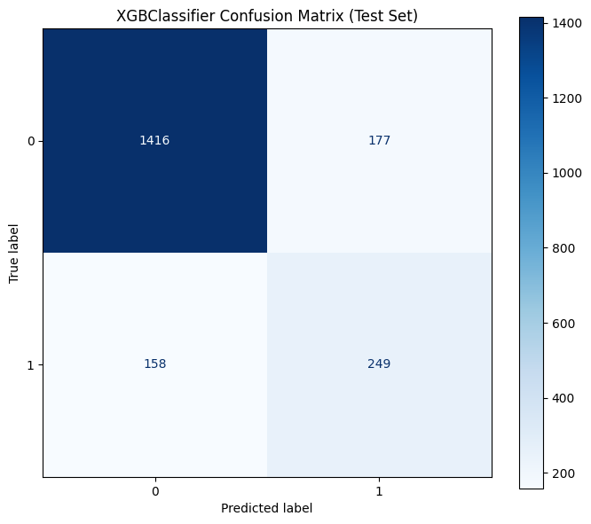

**Precision-Recall Curve:**
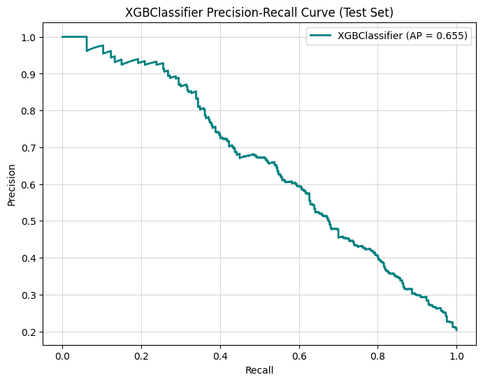

**ROC Curve:**
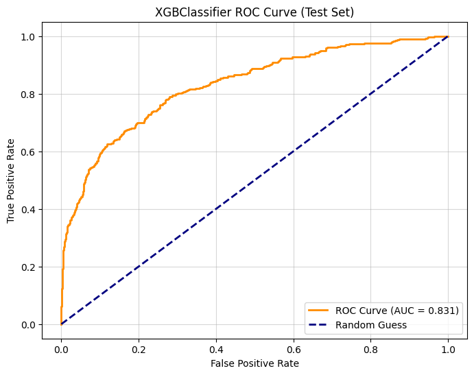

### SHAP Analysis

**SHAP Summary Bar Plot:**
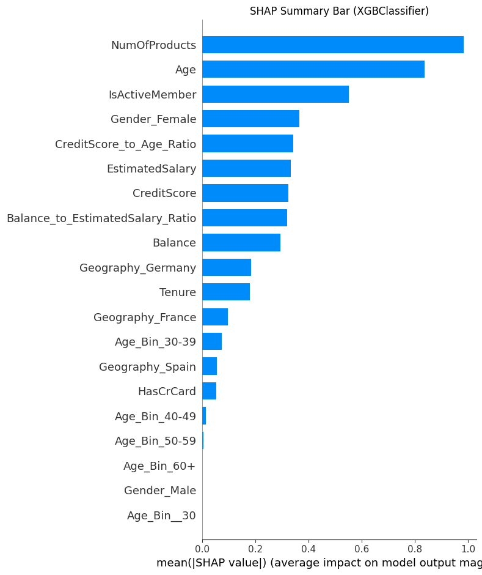

**SHAP Summary Dot Plot:**
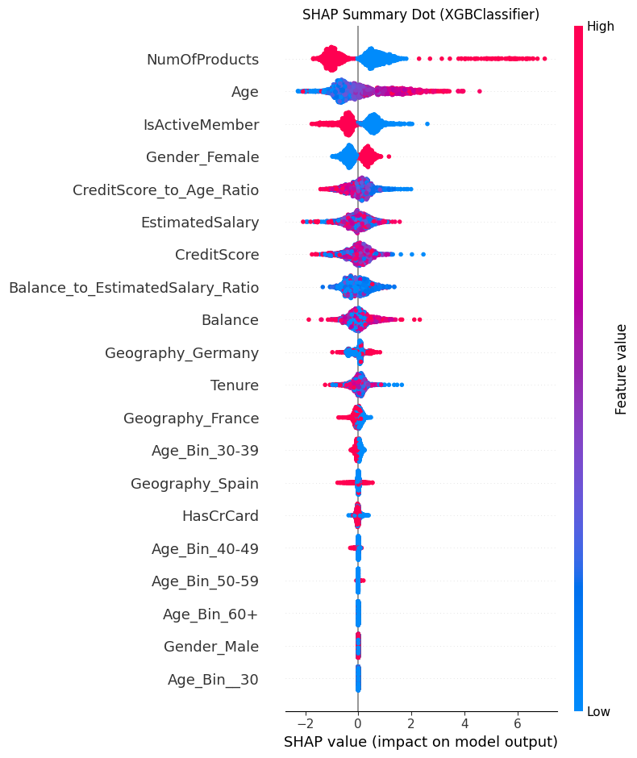

**SHAP Force Plot (Instance 0):**
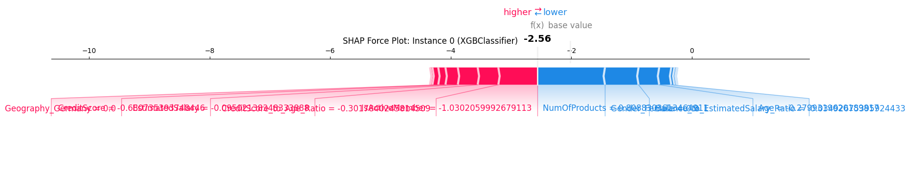

### SHAP Dependence Plots (Top Features)

**SHAP Dependence: Age**
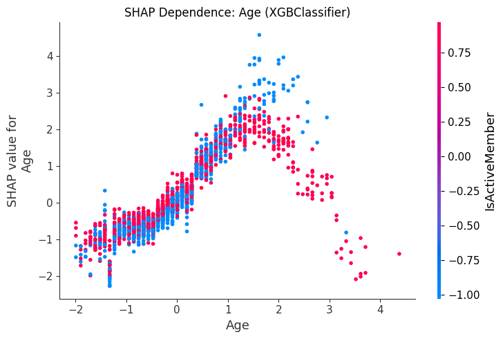

**SHAP Dependence: Balance**
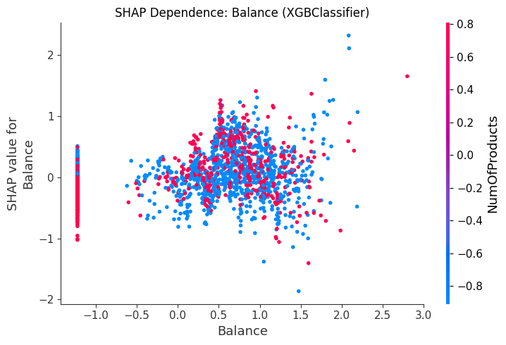

**SHAP Dependence: Balance to Estimated Salary Ratio**
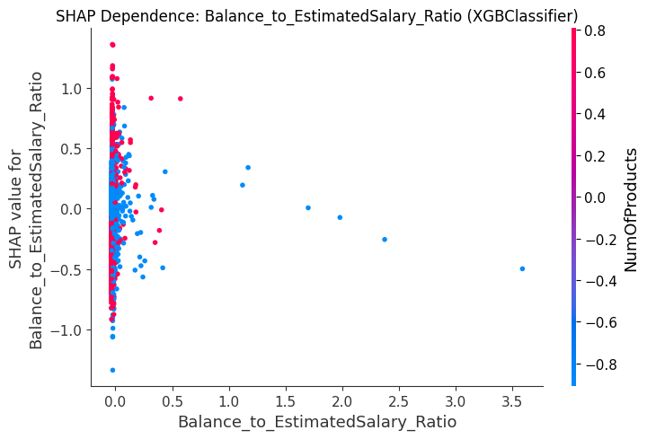

**SHAP Dependence: Credit Score**
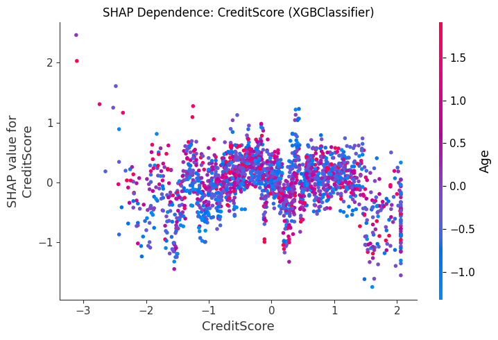

**SHAP Dependence: Credit Score to Age Ratio**
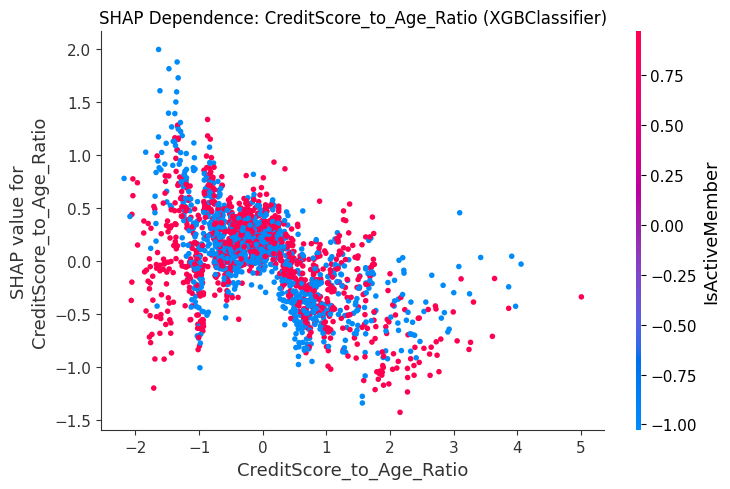

**SHAP Dependence: Estimated Salary**
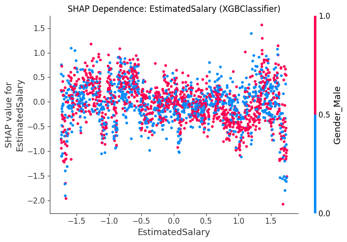

**SHAP Dependence: Gender Female**
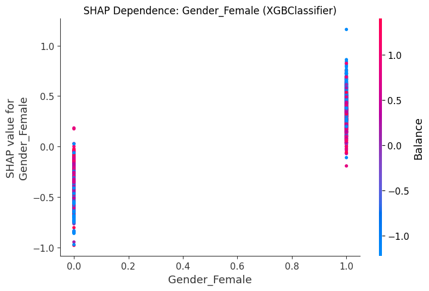

**SHAP Dependence: Geography Germany**
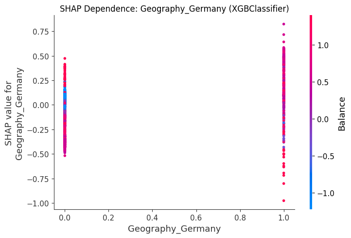

**SHAP Dependence: IsActiveMember**
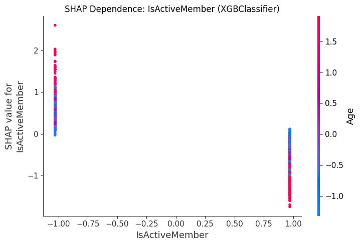

**SHAP Dependence: NumOfProducts**
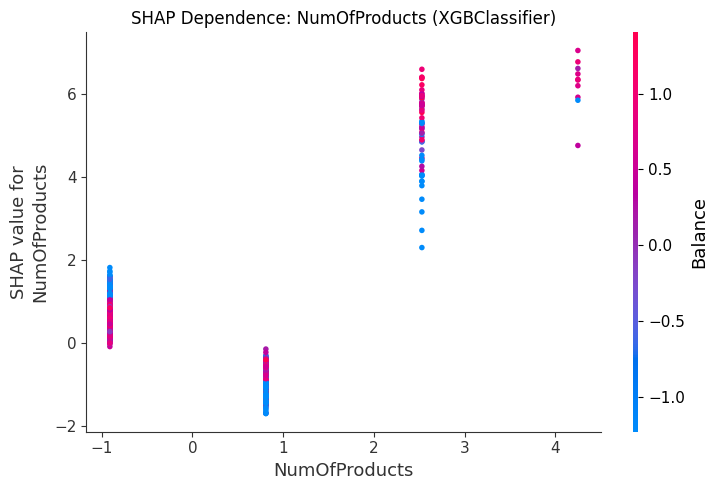

## API Usage

1.  **Run the API Server:**
    ```bash
    make run-api
    ```
2.  **Access Docs:** Open `http://localhost:8000/docs` in your browser for interactive documentation.

3.  **Example Request (Single Prediction using `curl`):**
    ```bash
    curl -X 'POST' \
      'http://localhost:8000/api/v1/predict' \
      -H 'accept: application/json' \
      -H 'Content-Type: application/json' \
      -d '{
        "CreditScore": 608,
        "Geography": "Spain",
        "Gender": "Female",
        "Age": 41,
        "Tenure": 1,
        "Balance": 83807.86,
        "NumOfProducts": 1,
        "HasCrCard": 0,
        "IsActiveMember": 1,
        "EstimatedSalary": 112542.58
      }'
    ```
    *(Expect JSON output like: `{"prediction":0,"probability_churn":0.123,"error":null}`)*

4.  **Example Request (Bulk Prediction using `curl`):**
    ```bash
    curl -X 'POST' \
      'http://localhost:8000/api/v1/predict/bulk' \
      -H 'accept: application/json' \
      -H 'Content-Type: application/json' \
      -d '{
        "inputs": [
          {
            "CreditScore": 608, "Geography": "Spain", "Gender": "Female", "Age": 41, "Tenure": 1,
            "Balance": 83807.86, "NumOfProducts": 1, "HasCrCard": 0, "IsActiveMember": 1, "EstimatedSalary": 112542.58
          },
          {
            "CreditScore": 750, "Geography": "France", "Gender": "Male", "Age": 35, "Tenure": 5,
            "Balance": 0.0, "NumOfProducts": 2, "HasCrCard": 1, "IsActiveMember": 1, "EstimatedSalary": 60000.0
          }
        ]
      }'
    ```
    *(Expect JSON output like: `{"results":[{"prediction":0,"probability_churn":0.123,"error":null},{"prediction":0,"probability_churn":0.050,"error":null}]}`)*


## Docker

A `Dockerfile` is provided to containerize the FastAPI application.

1.  **Build the Image:**
    ```bash
    docker build -t churn-prediction-api .
    ```
2.  **Run the Container:**
    ```bash
    docker run -p 8000:8000 --name churn_api_container churn-prediction-api
    ```
    *   The API will be accessible at `http://localhost:8000`.

## License

This project is licensed under the MIT License - see the [LICENSE](LICENSE) file for details.